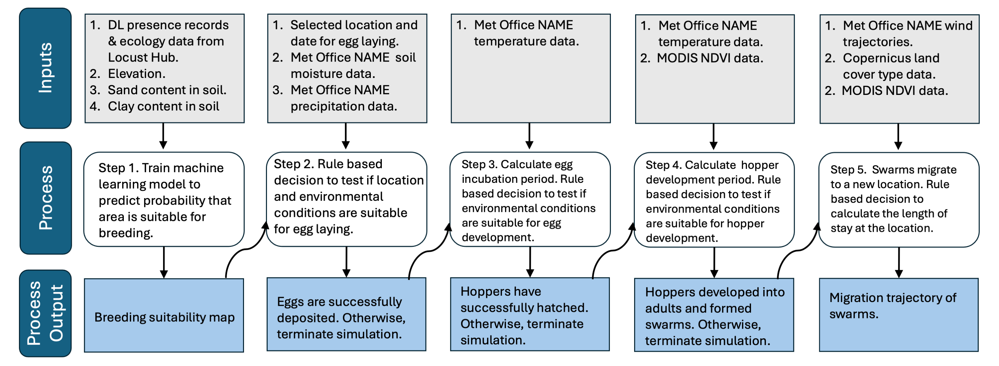

# PestDynamicsAndDispersal
 Renata Retkute, William Thurston, Keith Cressman, Christopher A. Gilligan. A framework for modelling migratory pest population dynamics and large-scale dispersal. https://www.biorxiv.org/content/10.1101/2023.07.11.548524v1

File '12 Tutorial.Rmd' provides a detailed tutorial on the essential steps in using the framework. The code integrates DL breeding, development through egg, hopper and adult stages, feeding and swarm migration with remote-sensed data and weather-driven models for wind trajectories. Before running the tutorial, download 'Data.zip' from [https://doi.org/10.17863/CAM.111882](https://doi.org/10.17863/CAM.111882)  and unarchive file with data. 

